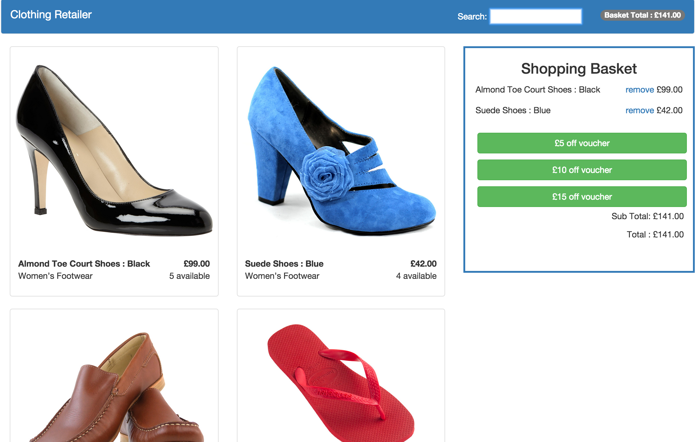

# clothing-retailer



A responsive shopping site for a clothing retailer. The retailer sells six different categories of clothes: women’s footwear, men’s footwear, women’s casualwear, men’s casualwear, women’s formalwear and man’s formalwear.

The prioritised list of user stories is as follows:
- [x] As a User I can view the products and their category, price and availability information.
- [x] As a User I can add a product to my shopping cart.
- [x] As a User I can remove a product from my shopping cart.
- [x]As a User I can view the total price for the products in my shopping cart.
- [x] As a User I can view the total price for the products in my shopping
cart.
- [x] As a User I can apply a voucher to my shopping cart.
- [x] As a User I can view the total price for the products in my shopping cart with discounts applied.
- [x] As a User I am alerted when I apply an invalid voucher to my shopping cart.
- [x] As a User I am unable to Out of Stock products to the shopping cart.

There are also discount vouchers available that can be redeemed. The discount vouchers are as follows:
• £5.00 off your order
• £10.00 off when you spend over £50.00
• £15.00 off when you have bought at least one footwear item and spent over £75.00

### Installation

You need [node.js](http://nodejs.org) installed globally:

```sh
$ git clone https://github.com/wardymate/clothing-retailer.git
$ cd clothing-retailer
$ npm install
$ npm start
$ visit [http://localhost:3000](visit http://localhost:3000)
```

### To run Tests

feature tests

```sh
$ webdriver-manager start and then protractor test/e2e/conf.js
```
unit tests

```sh
$ npm test
```

### File structure

### Technologies used

* [node.js](http://nodejs.org)
* [Twitter Bootstrap](http://twitter.github.com/bootstrap/)
* [express](http://expressjs.com)
* [AngularJS](http://angularjs.org)
* [Karma](http://karma-runner.github.io/0.12/index.html)
* [Karma](http://angular.github.io/protractor/#/)

### Approach and what I learnt

My approach was to write feature tests with protractor to help me build the elements that the app would require on the page and the functionality that the controller would have. I then wrote unit tests on my controler using Karma. I approached the functionality in the order of the user stories above. When all the users stories had been satisfied and both feature and unit test pass I added styling with CSS and Bootstrap adopting a mobile first approach so that the page display nicely for mobile, tablet and desktop.

I increased my overall understanding of Angular and protractor testing along with a greater understanding of Javascript and using bootstrap to assist with styling. I also improved my understanign of node and how to manage packages.

### Improvements

- [] Create an API to serve the products data
- [] Add a logo to the header bar - and improve name
- [] Allow functionality so that more items than are available can not be added to basket
- [] Record multiple items and create line totals
- [] Create custom directives to separate HTML
- [] Add animations for adding items to the basket
- [] Perhaps change the error message to a modal
- [] Explore other technologies to achieve a similar product
